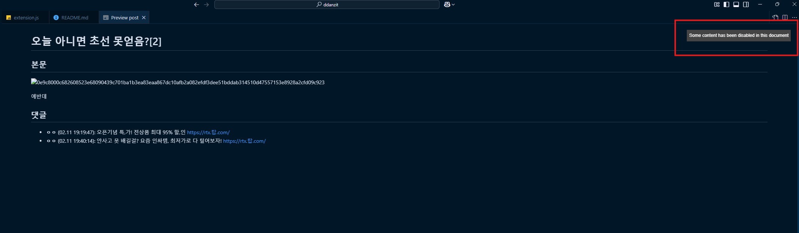
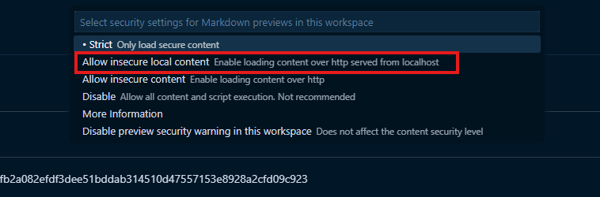
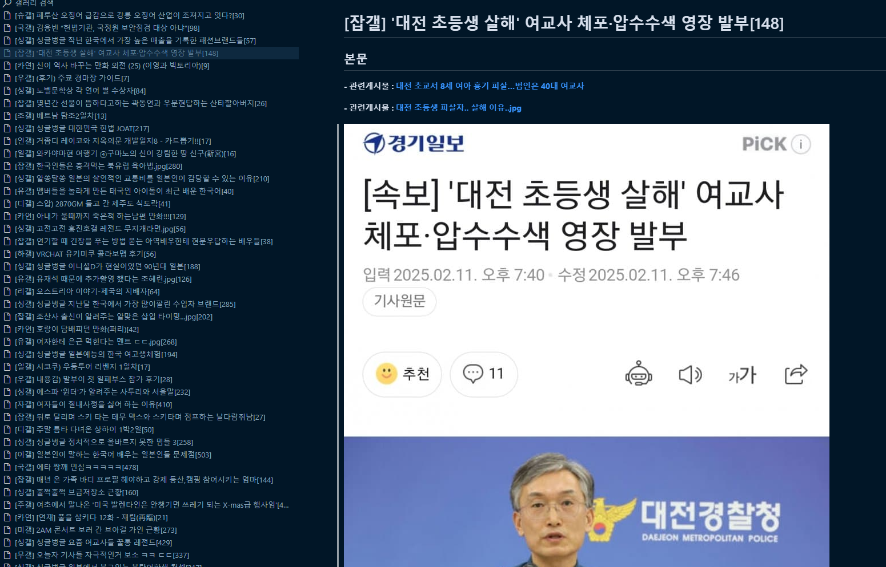

# DCinside 연동 VScode 확장팩


DCinside 연동 VScode 확장팩은 디시인사이드 갤러리의 게시글을 VS Code 내에서 바로 검색하고 읽을 수 있도록 도와줍니다.  
이 확장팩은 갤러리 게시글 목록을 사이드바 트리뷰로 제공하고, 선택한 게시글의 본문과 댓글을 Markdown 형식으로 변환하여 미리보기 창에서 보여줍니다.  
또한, 로컬에 Express 기반 프록시 서버를 구축하여 이미지 접근 시 필요한 헤더(예: Referer)를 추가함으로써 이미지 우회를 지원합니다.

---

## 주요 기능

- **갤러리 검색**  
  명령 팔레트(F1)나 사이드바의 "갤러리 검색" 버튼을 통해 디시인사이드 갤러리 ID(예: `pebble`)를 입력하면 해당 갤러리의 게시글 목록이 표시됩니다.

- **게시글 열기 및 Markdown 미리보기**  
  게시글 항목을 클릭하면, 게시글 본문과 댓글이 HTML에서 Markdown으로 변환되어 미리보기 창에 표시됩니다.  
  (이미지 URL은 로컬 프록시 서버를 통해 우회하여 로드됩니다.)

- **로컬 프록시 서버 지원**  
  Express를 사용하여 로컬에서 프록시 서버를 구동,  
  이미지 요청 시 `'Referer': 'https://gall.dcinside.com'` 등의 헤더를 추가하여 정상적으로 이미지를 불러올 수 있도록 합니다.

---

### 마크다운 미리보기에 사진 안나올 때





### 로컬설치
**현재 vscode에 배포되지않아 로컬 설치로만 가능**

```shell
npm install -g vsce
vsce package
code --install-extension ddanzit-0.0.2.vsix
```
설치가 안된다면 **ddanzit-0.0.2.vsix** 이 부분을 생성된 파일 이름으로 변경할 것

### 실행 화면

